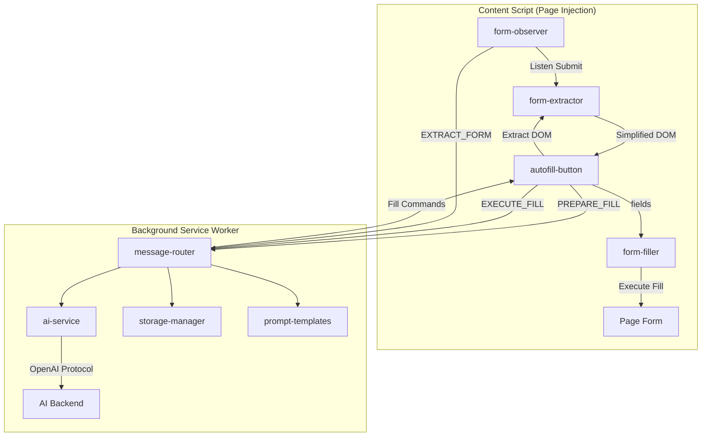

# 🤖 AI Form Helper

> AI-powered intelligent form data extraction & auto-fill Chrome extension

A Chrome extension built on Manifest V3 that leverages AI large language models (OpenAI-compatible protocol) to intelligently analyze page DOM structures, enabling automatic form field recognition, data extraction, and one-click filling. Supports major frontend component libraries with user profile memory and cross-page data reuse capabilities.

---

## ✨ Key Features

### 🧠 AI-Driven Smart Filling
- **DOM Structure Analysis**: AI directly analyzes simplified form DOM HTML to precisely understand the semantics and purpose of each field
- **Multi-Source Data Fusion**: Combines user profile, AI memory, and real-time user input to intelligently decide fill content
- **Priority Mechanism**: Current user input > Related memories > Historical profile, ensuring fill content matches current intent
- **Smart Generation Mode**: Optionally enable AI smart generation to auto-generate reasonable mock content for fields without historical data

### 📋 Form Data Extraction
- **Multi-Strategy Listening**: Native submit events, submit button clicks, Enter key submission, Ajax (fetch/XHR) request interception
- **AI Structured Extraction**: Converts raw form data into structured JSON via AI (with semantic classification, standardized labels)
- **Auto Profile Accumulation**: Automatically merges data into user profile after each form submission — gets smarter over time

### 🧩 Universal Component Library Support
Through **AI-powered DOM analysis**, the extension can intelligently recognize and fill form fields across virtually any frontend component library — no manual adapters needed:

- **Native HTML**: input, select, textarea, contenteditable
- **Major UI Frameworks**: Ant Design, Element UI/Plus, TDesign, Arco Design, Material UI, Naive UI, iView, Chakra UI, and more
- **Custom Components**: AI analyzes the actual DOM structure to understand custom form elements regardless of the framework used

### 🔮 Memory System
- **Auto Memory Extraction**: AI automatically extracts valuable memories from form data and user input (travel plans, preferences, etc.)
- **Category Management**: intent (plans), preference (habits), fact (facts), context (contextual info)
- **Expiry Management**: Supports expiration time settings with automatic cleanup of expired memories
- **Domain Association**: Memories can be isolated by domain or shared globally

### 🔌 Multiple AI Backend Compatibility
- **Qwen** (Alibaba Cloud DashScope)
- **DeepSeek**
- **OpenAI** (GPT-4o-mini, etc.)
- **Ollama Local Models** (e.g., qwen2.5:7b)
- Any service compatible with the OpenAI Chat Completions protocol

---

## 📸 Feature Preview

### Usage Flow

```
Page Load → Detect Form → Show Floating Button (📝)
    ↓ Click Button
Extract Simplified DOM → Get Profile + Memories → Show Supplementary Input Dialog
    ↓ Confirm Fill
Show Token Estimate → Call AI Analysis → Display Fill Plan
    ↓ Confirm Execution
Execute DOM Fill → Trigger Events → Update Profile + Memories
```

### Dialog Interface
- **📋 Existing Info**: Displays a summary of the accumulated user profile
- **🧠 AI Memories**: Shows memory entries related to the current domain
- **⚡ Detected Form Area**: Shows the number of recognized fields and estimated token consumption
- **📝 Supplement or Modify**: Natural language input for temporary modifications or additions
- **✨ AI Smart Generation Toggle**: When enabled, generates reasonable mock data for all empty fields

---

## 🏗️ Project Architecture

```
form-helper/
├── manifest.json                    # Chrome Extension config (Manifest V3)
├── package.json                     # Project metadata
├── build.js                         # Build script (ES Module → IIFE bundling)
├── test.html                        # Local test form page
│
├── src/
│   ├── shared/                      # Shared modules
│   │   ├── constants.js             # Message types, storage keys, default configs
│   │   └── utils.js                 # Utility functions (messaging, ID generation, etc.)
│   │
│   ├── background/                  # Background Service Worker
│   │   ├── index.js                 # Entry point, registers message listeners
│   │   ├── message-router.js        # Message router, handles all message types
│   │   ├── ai-service.js            # AI service layer, wraps OpenAI-compatible API calls
│   │   ├── prompt-templates.js      # Prompt template management (extraction/filling/memory)
│   │   └── storage-manager.js       # Chrome Storage read/write wrapper
│   │
│   ├── content/                     # Content Script
│   │   ├── index.js                 # Entry point, initializes listeners and button
│   │   ├── form-extractor.js        # Form DOM extraction & simplification
│   │   ├── form-filler.js           # Form fill executor
│   │   ├── form-observer.js         # Form submission listener (multi-strategy)
│   │   └── ui/                      # UI Components
│   │       ├── autofill-button.js   # Floating button + input dialog + AI result bubble
│   │       ├── confirm-dialog.js    # Data confirmation dialog
│   │       └── styles.css           # Base styles
│   │
│   └── popup/                       # Popup page (extension icon click)
│       ├── index.html               # Popup HTML (Settings / Profile / History tabs)
│       └── popup.js                 # Popup logic
│
└── dist/                            # Build output directory (load into Chrome)
```

### Module Communication Flow



---

## 🚀 Installation & Usage

### Requirements
- **Node.js** >= 14
- **Chrome Browser** >= 88 (Manifest V3 support)

### Installation Steps

```bash
# 1. Clone the project
git clone <your-repo-url>
cd form-helper

# 2. Build
npm run build
```

> After building, all files will be generated in the `dist/` directory.

### Load into Chrome

1. Open Chrome and navigate to `chrome://extensions/`
2. Enable "Developer mode" in the top right corner
3. Click "Load unpacked"
4. Select the project's `dist/` directory
5. The extension icon appears in the toolbar 🎉

### Basic Configuration

1. Click the extension icon in the toolbar to open the Popup panel
2. In the "⚙️ Settings" tab:
   - Select a **quick preset** (Qwen / DeepSeek / OpenAI / Ollama Local)
   - Enter your **API Key**
   - Click "💾 Save Settings"
3. When the status changes from ⚠️ to ✅, configuration is complete

### How to Use

#### Auto Fill
1. Open any webpage with a form
2. A 📝 floating button appears at the bottom right of the page
3. Click the button → A supplementary info dialog appears
4. Review existing info and estimated token consumption
5. Optionally enter supplementary content (e.g., "change address to Shanghai Pudong")
6. Click "🚀 Confirm Fill" → AI analysis → Preview fill plan → Confirm fill

#### Auto Extract
- Enable "Auto-detect form submission" and the extension will automatically listen for form submissions
- A confirmation dialog pops up on submission asking whether to save data to the user profile
- Data is automatically structured, categorized, and accumulated into the profile

---

## 🔧 Development Guide

### Scripts

```bash
# Build (output to dist/)
npm run build

# Watch mode (auto-rebuild on file changes)
npm run dev
```

### Build Details

The project uses a custom `build.js` build script (no webpack/rollup needed):

- **Background**: Merges all ES Module files into a single `background.js`
- **Content Script**: Merges all modules into IIFE-format `content.js` (Manifest V3 Content Scripts don't support ES Modules)
- **Popup**: Directly copies HTML/JS files
- **Icons**: Auto-generates placeholder icons (recommended to replace with actual PNG icons)

### Messaging Protocol

Content Script and Background communicate via `chrome.runtime.sendMessage`. Message types are defined in the `MSG` constant:

| Message Type | Direction | Description |
|-------------|-----------|-------------|
| `EXTRACT_FORM` | Content → BG | Send raw form data for AI structured extraction |
| `SAVE_RECORD` | Content → BG | Save form record and merge into profile |
| `PREPARE_FILL` | Content → BG | Get profile + memories, prepare for filling |
| `EXECUTE_FILL` | Content → BG | Send DOM + supplementary info, AI generates fill commands |
| `GET_CONFIG` / `SAVE_CONFIG` | Popup → BG | Read/write extension config |
| `GET_PROFILE` / `SAVE_PROFILE` | Popup → BG | Read/write user profile |
| `SAVE_MEMORY` / `GET_MEMORIES` / `DELETE_MEMORY` | Content/BG | Memory CRUD |

### Storage Structure

All data is stored in `chrome.storage.local`:

| Key | Description | Capacity Limit |
|-----|-------------|----------------|
| `user_config` | API config (endpoint, model, apiKey, etc.) | - |
| `user_profile` | User profile (personal info, contacts, addresses, etc.) | Max 50 change history entries |
| `form_records` | Form submission history | Max 100 records |
| `user_memories` | AI memory entries | Max 200 entries |
| `sdk_config` | SDK external integration config | - |

### Token Optimization

To control AI call costs, the project implements:
- **DOM Simplification**: Removes invisible elements, style attributes, and irrelevant attributes — keeping only the minimal form-related DOM structure
- **Profile Cleaning**: Strips `changeHistory`, `lastUpdated`, `id`, and other unnecessary fields before sending to AI
- **Token Estimation**: Displays estimated token consumption before filling (DOM + Profile + Memories + Template) to help users assess cost

---

## � Technical Details

### Form DOM Simplification Flow

```
Original Page DOM
    ↓ 1. Detect form areas (<form>, common form container selectors, area detection algorithm)
    ↓ 2. Filter invisible elements (display:none, visibility:hidden, zero dimensions)
    ↓ 3. Remove irrelevant attributes (keep name/id/type/placeholder/value/role/class/data-id, etc.)
    ↓ 4. Clean whitespace and comment nodes
Simplified DOM HTML → Send to AI
```

### AI Fill Flow

```
Simplified DOM + Cleaned Profile + Memories + User Supplement + Page Context
    ↓ buildFillPrompt() assembles Prompt
    ↓ callAIForJSON() calls AI
AI returns { fields: [{selector, label, value, type}], updatedProfile, newMemories }
    ↓ fillForm(fields) executes fill
    ↓ Locate elements by selector → setFieldValue() → triggerEvents()
    ↓ Merge updatedProfile into profile, save newMemories
```

---

## 🤝 Contributing

1. Fork this project
2. Create a feature branch (`git checkout -b feature/amazing-feature`)
3. Commit your changes (`git commit -m 'feat: add amazing feature'`)
4. Push the branch (`git push origin feature/amazing-feature`)
5. Create a Pull Request

---

## 📝 License

MIT
