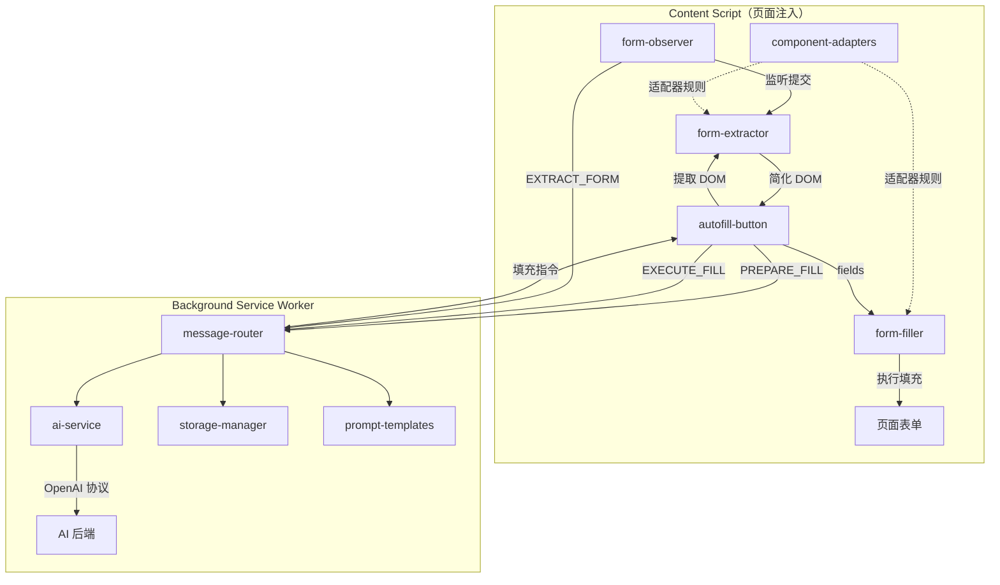

# 🤖 AI 表单助手 (Form Helper)

> AI 驱动的智能表单数据提取与自动填写 Chrome 浏览器插件

一款基于 Chrome Extension Manifest V3 的浏览器插件，通过 AI 大模型（兼容 OpenAI 协议）智能分析页面 DOM 结构，实现表单字段的自动识别、数据提取和一键填写。支持主流前端组件库，具备用户画像记忆和跨页面数据复用能力。

---

## ✨ 核心特性

### 🧠 AI 驱动的智能填充
- **DOM 结构分析**：AI 直接分析简化后的表单 DOM HTML，精准理解每个字段的语义和用途
- **多源数据融合**：综合用户画像、AI 记忆、用户实时补充三大数据源，智能决策填充内容
- **优先级机制**：用户本次补充 > 相关记忆 > 历史画像，确保填充内容符合当前意图
- **智能生成模式**：可选开启 AI 智能生成，为没有历史数据的字段自动生成合理的模拟内容

### 📋 表单数据提取
- **多策略监听**：原生 submit 事件、提交按钮点击、Enter 键提交、Ajax(fetch/XHR) 请求拦截
- **AI 结构化提取**：将原始表单数据通过 AI 转换为结构化 JSON（含语义分类、标准化标签）
- **自动画像积累**：每次表单提交后自动将数据合并到用户画像，越用越智能

### 🧩 广泛的组件库支持
通过**可插拔的适配器注册表**架构，支持以下组件库的表单元素识别与填充：

| 组件库 | 状态 | 支持元素 |
|--------|------|----------|
| **原生 HTML** | ✅ 内置 | input, select, textarea, contenteditable |
| **Ant Design** | ✅ 适配 | Input, Select, DatePicker, Cascader, Radio, Checkbox, Switch 等 |
| **Element UI / Plus** | ✅ 适配 | Input, Select, DateEditor, Cascader, Radio, Checkbox, Switch 等 |
| **TDesign** | ✅ 适配 | Input, Select, DatePicker, Textarea |
| **Arco Design** | ✅ 适配 | Input, Select, Picker, Cascader, Radio, Checkbox |
| **Material UI (MUI)** | ✅ 适配 | Input, Select, TextField, Autocomplete |
| **Naive UI** | ✅ 适配 | Input, Select, DatePicker |
| **iView / View Design** | ✅ 适配 | Input, Select, DatePicker |
| **Chakra UI** | ✅ 适配 | Input, Select |
| **WG Components** | ✅ 适配 | Input, Select（含自定义下拉选项提取与填充） |
| **mod-form** | ✅ 适配 | 自定义表单框架 |

### 🔮 记忆系统
- **自动记忆提取**：AI 从表单数据和用户输入中自动提取有价值的记忆（出行计划、偏好习惯等）
- **分类管理**：intent（意图计划）、preference（偏好）、fact（事实）、context（上下文）
- **时效管理**：支持设置过期时间，自动清理过期记忆
- **域名关联**：记忆可按域名隔离或全局共享

### 🔌 兼容多种 AI 后端
- **通义千问**（阿里云 DashScope）
- **DeepSeek**
- **OpenAI** (GPT-4o-mini 等)
- **Ollama 本地模型**（如 qwen2.5:7b）
- 任何兼容 OpenAI Chat Completions 协议的服务

---

## 📸 功能预览

### 使用流程

```
页面加载 → 检测表单 → 显示浮动按钮(📝)
    ↓ 点击按钮
提取简化 DOM → 获取画像+记忆 → 弹出补充输入弹窗
    ↓ 确认填写
显示 Token 估算 → 调用 AI 分析 → 展示填充方案
    ↓ 确认填充
执行 DOM 填充 → 触发事件 → 更新画像+记忆
```

### 弹窗界面说明
- **📋 已有信息**：展示从历史积累的用户画像摘要
- **🧠 AI 记忆**：展示与当前域名相关的记忆条目
- **⚡ 检测到的表单区域**：显示识别到的字段数量和 Token 消耗预估
- **📝 补充或修改信息**：自然语言输入框，支持临时修改或补充数据
- **✨ AI 智能生成开关**：开启后为所有空字段生成合理模拟数据

---

## 🏗️ 项目架构

```
form-helper/
├── manifest.json                    # Chrome Extension 配置（Manifest V3）
├── package.json                     # 项目元数据
├── build.js                         # 构建脚本（ES Module → IIFE 打包）
├── test.html                        # 本地测试表单页面
│
├── src/
│   ├── shared/                      # 公共模块
│   │   ├── constants.js             # 消息类型、存储Key、默认配置等常量
│   │   └── utils.js                 # 通用工具函数（消息通信、ID生成等）
│   │
│   ├── background/                  # Background Service Worker
│   │   ├── index.js                 # 入口，注册消息监听
│   │   ├── message-router.js        # 消息路由器，处理所有消息类型
│   │   ├── ai-service.js            # AI 服务层，封装 OpenAI 兼容协议调用
│   │   ├── prompt-templates.js      # Prompt 模板管理（提取/填充/记忆）
│   │   └── storage-manager.js       # Chrome Storage 读写封装
│   │
│   ├── content/                     # Content Script
│   │   ├── index.js                 # 入口，初始化监听和按钮
│   │   ├── form-extractor.js        # 表单 DOM 提取与简化
│   │   ├── form-filler.js           # 表单填充执行器
│   │   ├── form-observer.js         # 表单提交监听（多策略）
│   │   ├── component-adapters.js    # 组件库适配器注册表
│   │   └── ui/                      # UI 组件
│   │       ├── autofill-button.js   # 浮动按钮 + 补充输入弹窗 + AI结果气泡
│   │       ├── confirm-dialog.js    # 数据确认弹窗
│   │       └── styles.css           # 基础样式
│   │
│   └── popup/                       # 弹出页面（点击扩展图标）
│       ├── index.html               # Popup HTML（设置/画像/历史三Tab）
│       └── popup.js                 # Popup 逻辑
│
└── dist/                            # 构建输出目录（加载到 Chrome）
```

### 模块通信流程



---

## 🚀 安装与使用

### 环境要求
- **Node.js** >= 14
- **Chrome 浏览器** >= 88（支持 Manifest V3）

### 安装步骤

```bash
# 1. 克隆项目
git clone <your-repo-url>
cd form-helper

# 2. 构建
npm run build
```

> 构建完成后会在 `dist/` 目录生成所有文件。

### 加载到 Chrome

1. 打开 Chrome，访问 `chrome://extensions/`
2. 开启右上角「开发者模式」
3. 点击「加载已解压的扩展程序」
4. 选择项目的 `dist/` 目录
5. 扩展图标出现在工具栏 🎉

### 基本配置

1. 点击工具栏的扩展图标，打开 Popup 面板
2. 在「⚙️ 设置」Tab 中：
   - 选择一个**快捷预设**（通义千问 / DeepSeek / OpenAI / Ollama 本地）
   - 填写你的 **API Key**
   - 点击「💾 保存设置」
3. 状态提示从 ⚠️ 变为 ✅ 即配置成功

### 使用方式

#### 自动填写
1. 打开任意包含表单的网页
2. 页面右下角会出现 📝 浮动按钮
3. 点击按钮 → 弹出补充信息窗口
4. 查看已有信息、预估 Token 消耗
5. 可选输入补充内容（如「地址改成上海浦东」）
6. 点击「🚀 确认填写」→ AI 分析 → 预览填充方案 → 确认填充

#### 自动提取
- 开启「自动检测表单提交」后，插件会自动监听表单提交
- 提交时弹窗确认是否保存数据到用户画像
- 数据会自动结构化分类并积累到画像中

---

## 🔧 开发指南

### 项目脚本

```bash
# 构建（输出到 dist/）
npm run build

# 监听模式（文件变化自动重新构建）
npm run dev
```

### 构建说明

项目使用自定义的 `build.js` 构建脚本（无需 webpack/rollup 等构建工具）：

- **Background**：将所有 ES Module 文件合并为单个 `background.js`
- **Content Script**：将所有模块合并为 IIFE 格式的 `content.js`（因 Manifest V3 的 Content Script 不支持 ES Module）
- **Popup**：直接复制 HTML/JS 文件
- **图标**：自动生成占位图标（建议替换为真正的 PNG 图标）

### 添加新的组件库适配器

在 [component-adapters.js](/src/content/component-adapters.js) 中使用 `registerAdapter()` 注册：

```javascript
registerAdapter({
  name: 'your-ui-lib',

  // 该库的可交互输入元素选择器
  inputSelector: [
    '.your-input',
    '.your-select',
  ],

  // 表单容器选择器（用于表单区域检测）
  containerSelector: [
    '[class*="your-form" i]',
  ],

  // Label 选择器
  labelSelector: ['.your-form-label'],

  // 类型推断规则：className 正则 → 类型
  typeRules: [
    { match: /your-select/i, type: 'select' },
    { match: /your-input/i, type: 'text' },
  ],

  // 下拉搜索框选择器（应排除，避免误识别为表单字段）
  searchInputSelector: [
    '.your-select-search-input',
  ],

  // （可选）从自定义下拉中提取选项
  optionExtractor(input) {
    const items = input.closest('.your-select')?.querySelectorAll('.option-item');
    if (!items) return null;
    return Array.from(items).map(item => ({
      value: item.textContent.trim(),
      text: item.textContent.trim(),
    }));
  },

  // （可选）为自定义组件设置值
  valueSetter(input, value) {
    // 返回 true=成功, false=失败, null=不处理（交给下一个适配器）
    return null;
  },
});
```

### 消息通信协议

Content Script 与 Background 之间通过 `chrome.runtime.sendMessage` 通信，消息类型定义在 `MSG` 常量中：

| 消息类型 | 方向 | 说明 |
|----------|------|------|
| `EXTRACT_FORM` | Content → BG | 发送原始表单数据，AI 结构化提取 |
| `SAVE_RECORD` | Content → BG | 保存表单记录并合并到画像 |
| `PREPARE_FILL` | Content → BG | 获取画像 + 记忆，准备填写 |
| `EXECUTE_FILL` | Content → BG | 发送 DOM + 补充信息，AI 生成填充指令 |
| `GET_CONFIG` / `SAVE_CONFIG` | Popup → BG | 读写插件配置 |
| `GET_PROFILE` / `SAVE_PROFILE` | Popup → BG | 读写用户画像 |
| `SAVE_MEMORY` / `GET_MEMORIES` / `DELETE_MEMORY` | Content/BG | 记忆 CRUD |

### 存储结构

所有数据存储在 `chrome.storage.local` 中：

| Key | 说明 | 容量限制 |
|-----|------|----------|
| `user_config` | API 配置（endpoint、model、apiKey 等） | - |
| `user_profile` | 用户画像（个人信息、联系方式、地址等） | 变更历史最多 50 条 |
| `form_records` | 表单提交历史记录 | 最多 100 条 |
| `user_memories` | AI 记忆条目 | 最多 200 条 |
| `sdk_config` | SDK 外部接入配置 | - |

### Token 优化

为控制 AI 调用成本，项目做了以下优化：
- **DOM 简化**：去除不可见元素、style 属性、无关属性，仅保留表单相关的最小 DOM 结构
- **画像清洗**：发送给 AI 前剔除 `changeHistory`、`lastUpdated`、`id` 等无用字段
- **Token 预估**：填充前展示预估 Token 消耗（DOM + 画像 + 记忆 + 模板），帮助用户判断成本

---

## 📄 技术细节

### 表单 DOM 简化流程

```
原始页面 DOM
    ↓ 1. 检测表单区域（<form>、适配器容器选择器、区域检测算法）
    ↓ 2. 过滤不可见元素（display:none、visibility:hidden、尺寸为0）
    ↓ 3. 移除无关属性（保留 name/id/type/placeholder/value/role/class/data-id 等）
    ↓ 4. 清理空白和注释节点
简化 DOM HTML → 发送给 AI
```

### AI 填充流程

```
简化 DOM + 清洗画像 + 记忆 + 用户补充 + 页面上下文
    ↓ buildFillPrompt() 组装 Prompt
    ↓ callAIForJSON() 调用 AI
AI 返回 { fields: [{selector, label, value, type}], updatedProfile, newMemories }
    ↓ fillForm(fields) 执行填充
    ↓ 根据 selector 定位元素 → setFieldValue() → triggerEvents()
    ↓ 合并 updatedProfile 到画像、保存 newMemories
```

---

## 🤝 贡献指南

1. Fork 本项目
2. 创建特性分支 (`git checkout -b feature/amazing-feature`)
3. 提交更改 (`git commit -m 'feat: add amazing feature'`)
4. 推送分支 (`git push origin feature/amazing-feature`)
5. 创建 Pull Request

---

## 📝 License

MIT
